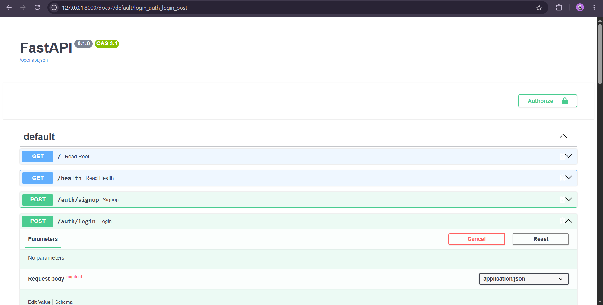
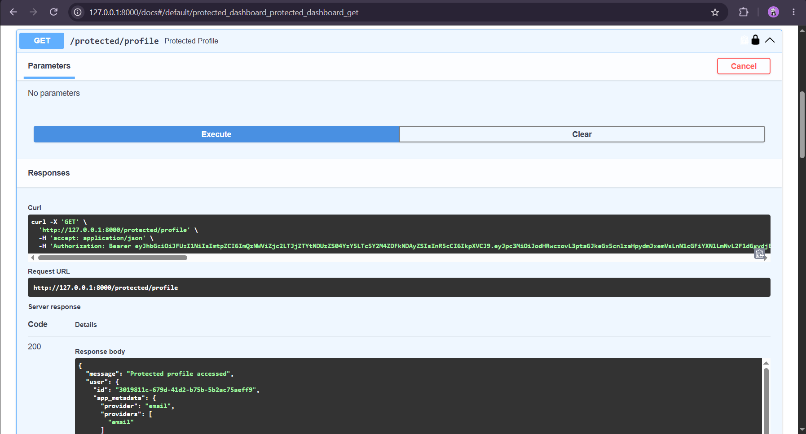
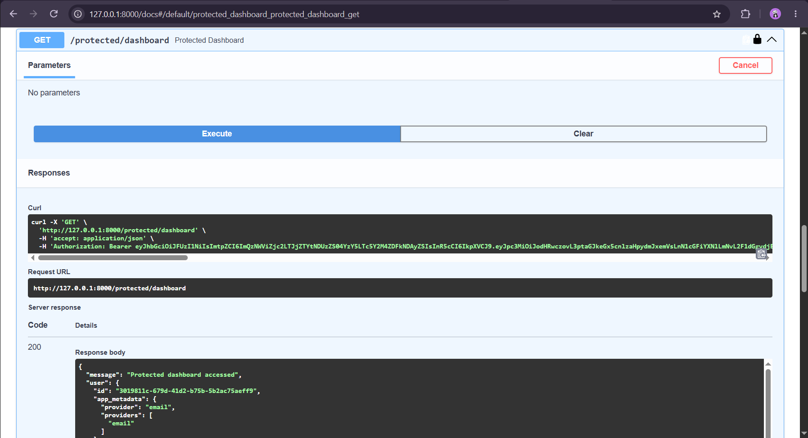

# A3 — Auth Login & Protect API

A secure FastAPI authentication API built with **Supabase Auth** and **JWT-based authentication**.

This project allows users to:

- Sign up
- Log in
- Log out
- Access protected routes using a valid JWT
- Access public routes without authentication
- Verify JWTs through Supabase Auth
- Test protected endpoints through Swagger UI

## Authentication Flow

```text
Client
   ↓
Supabase Auth
   ↓
Access Token (JWT)
   ↓
FastAPI Backend
   ↓
JWT Verification
   ↓
Protected Data
```

The client sends the access token using:

```text
Authorization: Bearer <access_token>
```

FastAPI uses a reusable authentication dependency to verify the token with Supabase before allowing access to protected routes.

## Tech Stack

- Python 3.10+
- FastAPI
- Supabase Auth
- JWT
- Pydantic
- SQLite
- python-dotenv
- Git & GitHub
- Swagger UI / OpenAPI

## Project Structure

```text
A3-Auth-Login-Protect/
│
├── main.py
├── requirements.txt
├── .gitignore
├── .env
├── tasks.db
└── README.md
```

> `.env` and other sensitive/local files should not be committed to GitHub.

## Environment Setup

Create a `.env` file in the project root:

```env
SUPABASE_URL=your_supabase_project_url
SUPABASE_KEY=your_supabase_key
```

The `.env` file contains environment variables and should remain private.

## Installation

Create and activate a virtual environment:

```powershell
python -m venv .venv
```

Activate it on Windows:

```powershell
.venv\Scripts\Activate.ps1
```

Install the required packages:

```powershell
pip install -r requirements.txt
```

## Run the API

Start the FastAPI development server:

```powershell
uvicorn main:app --reload
```

The API will be available at:

```text
http://localhost:8000
```

Swagger UI:

```text
http://localhost:8000/docs
```

## API Endpoints

| Method | Endpoint               | Authentication | Description                              |
| ------ | ---------------------- | -------------- | ---------------------------------------- |
| POST   | `/auth/signup`         | No             | Create a new user account                |
| POST   | `/auth/login`          | No             | Log in and receive access/refresh tokens |
| POST   | `/auth/logout`         | Yes            | Log out an authenticated user            |
| GET    | `/protected/profile`   | Yes            | Get authenticated user information       |
| GET    | `/protected/dashboard` | Yes            | Access protected dashboard               |
| GET    | `/public/info`         | No             | Access public information                |
| GET    | `/`                    | No             | API information                          |
| GET    | `/health`              | No             | Health check                             |
| GET    | `/tasks`               | No             | Get all tasks                            |
| GET    | `/tasks/{id}`          | No             | Get a task by ID                         |
| POST   | `/tasks`               | No             | Create a task                            |
| PUT    | `/tasks/{id}`          | No             | Update a task                            |
| DELETE | `/tasks/{id}`          | No             | Delete a task                            |

## Authentication

### 1. Sign Up

Send a request to:

```text
POST /auth/signup
```

Example request:

```json
{
  "email": "user@example.com",
  "password": "your-password"
}
```

A successful signup returns:

```text
201 Created
```

### 2. Log In

Send a request to:

```text
POST /auth/login
```

Example request:

```json
{
  "email": "user@example.com",
  "password": "your-password"
}
```

A successful login returns an access token and refresh token:

```json
{
  "access_token": "your-access-token",
  "refresh_token": "your-refresh-token"
}
```

### 3. Access Protected Routes

Protected routes require:

```text
Authorization: Bearer <access_token>
```

The FastAPI authentication dependency extracts the token and verifies it using:

```python
supabase.auth.get_user(token)
```

A valid token allows access, while a missing, invalid, expired, or tampered token returns:

```text
401 Unauthorized
```

## HTTP Status Codes

| Status Code | Meaning                                   |
| ----------- | ----------------------------------------- |
| `200`       | Successful request                        |
| `201`       | Resource created successfully             |
| `204`       | Successful request with no response body  |
| `400`       | Invalid request / signup error            |
| `401`       | Authentication failed or token is invalid |
| `404`       | Resource not found                        |

## Swagger UI

FastAPI automatically provides interactive API documentation through Swagger UI.

Open:

```text
http://localhost:8000/docs
```

Swagger provides an **Authorize 🔒** button that can be used to provide the Bearer token and test protected endpoints.

### Swagger Authorization



### Protected Profile



### Protected Dashboard



## Security

Authentication is handled by **Supabase Auth** rather than implementing password hashing and cryptography manually.

Important security practices:

- Never commit `.env` to GitHub.
- Never expose Supabase secrets or credentials publicly.
- Protected routes require a valid JWT.
- Invalid or expired tokens are rejected with `401 Unauthorized`.
- Bearer authentication is configured for Swagger UI.

## Learning Outcome

This project demonstrates how to build a FastAPI backend with authentication using an external authentication provider.

Key concepts practiced:

- FastAPI routing
- Supabase authentication
- JWT access tokens
- Bearer authentication
- Protected API routes
- FastAPI dependencies
- HTTP status codes
- Swagger/OpenAPI documentation
- Environment variables
- Git and GitHub workflow

